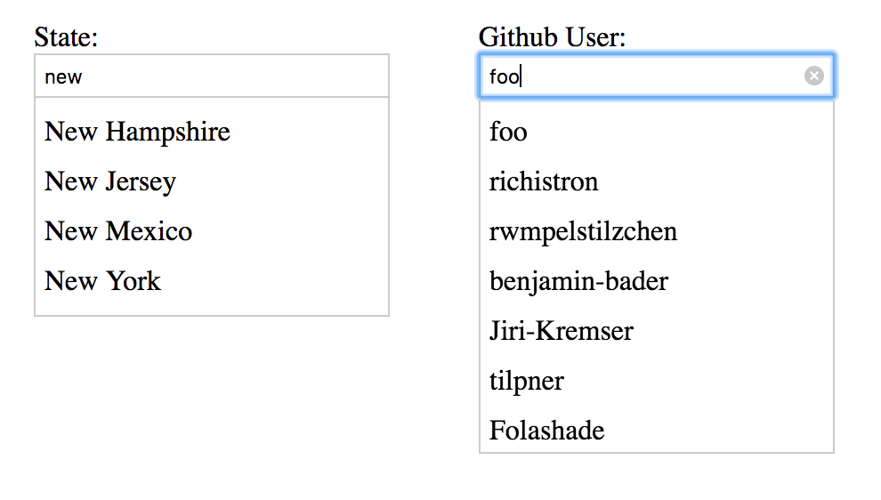

# Geowealth Frontend Take-home Exercise

Hi there! Here is a coding exercise to help us assess your technical skills.
We recommend you focus on the core requirements first, then work on any 
additional features if you have the time.

By the end, please feel free to stop working and explain what refactors /
code organization / enhancements you would have made with more time in the
SOLUTION.md file.

If you have any questions at any point, please reach us on email.

## Submission

Please **fork** this repository and commit all your changes to it.
When you're done, send us the email with your Github repository URL.

## Overview

This project was bootstrapped with [Create React App](https://github.com/facebook/create-react-app). 

We’ve built a simple Autocomplete/Typeahead component in vanilla ES2015 that
lets you type in a query and shows a list of matching results in a dropdown.
You can find its definitions in the `public/js/Autocomplete.js` folder and usage in
`public/js/index.js` and `public/index.html`

To see this component in action, let's set up the repo:

1. Run `npm install`
2. Run `npm start` Runs the app in the development mode.\
3. Open [http://localhost:3000](http://localhost:3000) to view it in your browser.

Type "new" in the input, and you'll get a list of matching US states that start
with "new".

## Main Task

1. Convert the Autocomplete to a React Component (feel free to create your own structure).
2. When item in dropdown is selected by mouse click, show the selected item in the
search field (same as Google is doing it).
3. Create an additional Component (position is up to you) that shows the last 10 searches of the Autocomplete

## Bonus Tasks

Currently, the component can only query against a static data array. Your task is to:

1. Enhance the component so that it also accepts an HTTP endpoint as data source.

    For example, if you wire up the component to
    `https://api.github.com/search/users?q={query}&per_page={numOfResults}`,
    and if you type `foo` in the input, the component dropdown should show
    Github users with logins that start with `foo`. When you select a user from
    the results, `item` in the `onSelect(item)` callback should be the selected
    Github user's id.

    (The enhanced initialised component only needs to work with either a data array or a
    HTTP source, not both at the same time.)

2. Implement keyboard shortcuts to navigate the results dropdown using up/down
   arrow keys and to select a result using the Enter key.

## Requirements

- The component should be reusable. It should be possible to have multiple
  instances of the component on the same page.
- The "States" example that uses a data array should be enhanced with your code and continue to work.
- You don't need to preserve any of the existing code; feel free to modify them
  as you wish.
- New APIs and your notes should be documented in `SOLUTION.md`.
