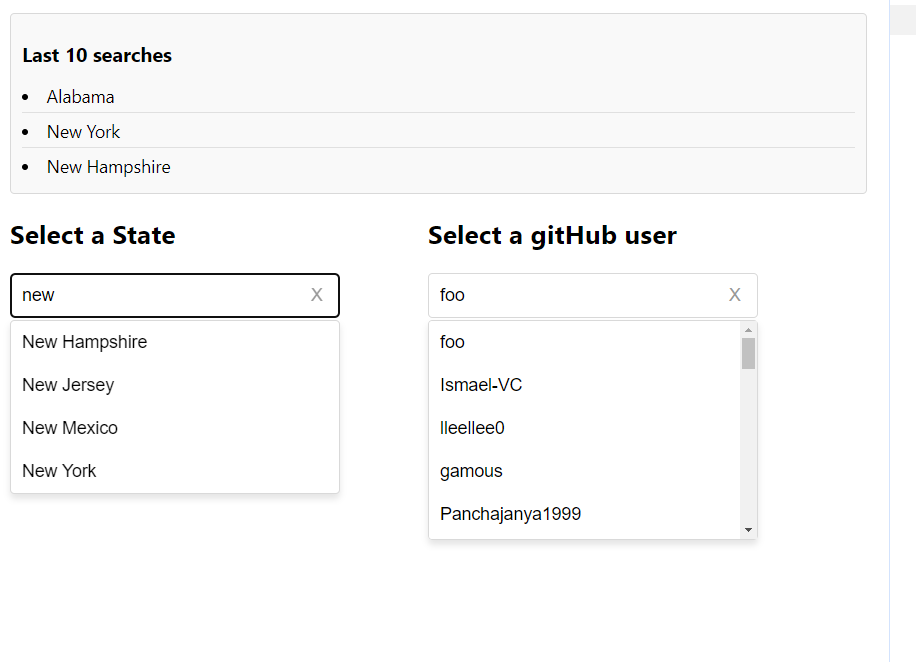

# Solution Docs

<!-- You can include documentation, additional setup instructions, notes etc. here -->

	import React, { useEffect, useState } from "react";
	import Dropdown from "./components/Dropdown.jsx";
	import states from "./us-states.json";
	import LastSearches from "./components/LastSearches.jsx";

	

## APP Component <App />
App is the main component of the application that manages the state of the search queries for both GitHub users and US states. It handles fetching data from the GitHub API, filtering state data, and managing the user's last 10 searches.

State Variables:
lastSearches: Stores the last 10 searches performed by the user.
stateQuery: Stores the current input query for searching US states.
userQuery: Stores the current input query for searching GitHub users.
gitHubUsers: Stores the list of GitHub users returned from the API.
usStates: Stores the list of filtered US states based on the stateQuery.

Functions:
useEffect for GitHub Users: This effect fetches GitHub user data based on the userQuery when the query changes.
useEffect for US States: This effect filters the US states based on the stateQuery.
addToLastSearches: Adds the selected search item to the list of last searches (with a maximum of 10 entries).

Render:
LastSearches: Displays the last 10 searches performed by the user.
Dropdown for States: Provides a dropdown for searching and selecting US states.
Dropdown for GitHub Users: Provides a dropdown for searching and selecting GitHub users.

## Dropdown Component

	import React, { useCallback, useEffect, useState } from "react";
	import "./module.css";

Description:
Dropdown is a reusable component that allows users to search through a list of options and select an item. It supports both keyboard and mouse interactions for better accessibility.

Props:
options: An array of objects that represent the available options for selection (e.g., { name: "optionName", id: 1 }).
getLastSearch: (Optional) A callback function to pass the selected item to the parent component, specifically for adding it to the search history.
query: The current input value for filtering the dropdown options.
setQuery: A function to update the query state in the parent component.

State Variables:
isDropdownOpen: A boolean indicating if the dropdown is currently open.
highlightedIndex: An integer representing the index of the currently highlighted option (for keyboard navigation).

Functions:
handleQueryChange: Updates the query as the user types into the search input and resets the highlighted index.
handleOptionClick: Handles the selection of an option (either by click or keyboard) and triggers the getLastSearch callback if provided.
handleKeyDown: Handles keyboard events to navigate the dropdown with up/down arrows and select an option with the Enter key.
useEffect for Event Listeners: Adds and removes keyboard event listeners based on whether the dropdown is open.

Render:
Search Input: Provides a text input for filtering the options.
Dropdown List: Displays the filtered options, with one option highlighted based on the user's keyboard navigation.

<Dropdown
  options={usStates}
  query={stateQuery}
  setQuery={setStateQuery}
  getLastSearch={addToLastSearches}
/>

Keyboard Accessibility:
Up Arrow: Navigates to the previous option in the list.
Down Arrow: Navigates to the next option in the list.
Enter: Selects the highlighted option.
Escape: Closes the dropdown without making a selection.

## LastSearches Component

import React from "react";
import "./lastSearch.css"; 

Description:
LastSearches is a simple component that displays a list of the user's last 10 search selections.

Props:
lastSearches: An array of strings representing the user's last 10 searches.

Render:
Displays an ordered list (<li>) of the last searches.
If no searches have been performed, it shows a message indicating that there are no searches yet.

Example Usage:

Last 10 searches
1. California
2. Texas
3. Florida

If no searches have been performed:

There is no searches yet
